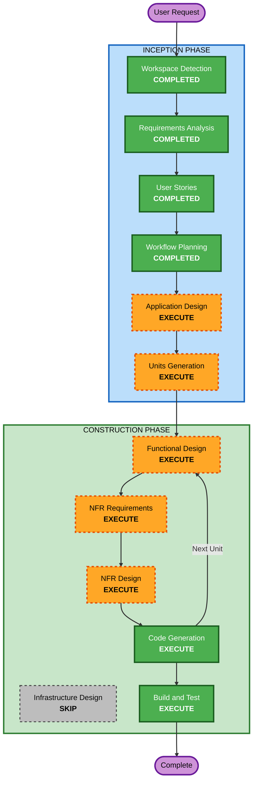

# Execution Plan

## Detailed Analysis Summary

### Change Impact Assessment
- **User-facing changes**: Yes - 고객용 주문 UI, 관리자용 대시보드 UI 신규 개발
- **Structural changes**: Yes - Backend API, 2개 Frontend, DB 스키마 전체 신규
- **Data model changes**: Yes - Store, Table, Menu, Order, OrderHistory, Session 등 데이터 모델 설계 필요
- **API changes**: Yes - REST API 전체 신규 설계 (인증, 메뉴, 주문, 테이블 관리, SSE)
- **NFR impact**: Yes - SSE 실시간 통신, JWT 인증, 멀티테넌시, 이미지 업로드

### Risk Assessment
- **Risk Level**: Medium
- **Rollback Complexity**: Easy (Greenfield - 롤백 필요 없음)
- **Testing Complexity**: Moderate (SSE 실시간, 멀티 매장 데이터 격리 테스트 필요)

## Workflow Visualization



### Text Alternative
```
Phase 1: INCEPTION
- Workspace Detection (COMPLETED)
- Requirements Analysis (COMPLETED)
- User Stories (COMPLETED)
- Workflow Planning (COMPLETED)
- Application Design (EXECUTE)
- Units Generation (EXECUTE)

Phase 2: CONSTRUCTION (per-unit loop)
- Functional Design (EXECUTE, per-unit)
- NFR Requirements (EXECUTE, per-unit)
- NFR Design (EXECUTE, per-unit)
- Infrastructure Design (SKIP)
- Code Generation (EXECUTE, per-unit)
- Build and Test (EXECUTE)
```

## Phases to Execute

### INCEPTION PHASE
- [x] Workspace Detection (COMPLETED)
- [x] Requirements Analysis (COMPLETED)
- [x] User Stories (COMPLETED)
- [x] Workflow Planning (IN PROGRESS)
- [ ] Application Design - EXECUTE
  - **Rationale**: 신규 프로젝트로 컴포넌트 식별, 서비스 레이어 설계, 데이터 모델 정의 필요
- [ ] Units Generation - EXECUTE
  - **Rationale**: Backend, Customer Frontend, Admin Frontend 3개 유닛으로 분리하여 독립적 개발 단위 구성 필요

### CONSTRUCTION PHASE (per-unit)
- [ ] Functional Design - EXECUTE (per-unit)
  - **Rationale**: 각 유닛별 비즈니스 로직, 데이터 모델, API 엔드포인트 상세 설계 필요
- [ ] NFR Requirements - EXECUTE (per-unit)
  - **Rationale**: SSE 실시간 통신, JWT 인증, 멀티테넌시, 이미지 업로드 등 기술 스택 상세 결정 필요
- [ ] NFR Design - EXECUTE (per-unit)
  - **Rationale**: NFR 패턴을 각 유닛 설계에 반영 (인증 미들웨어, SSE 구현, 멀티테넌시 패턴 등)
- [ ] Infrastructure Design - SKIP
  - **Rationale**: 배포 환경이 로컬 개발 환경으로 결정됨. 별도 인프라 설계 불필요
- [ ] Code Generation - EXECUTE (per-unit, ALWAYS)
  - **Rationale**: 코드 구현 필수
- [ ] Build and Test - EXECUTE (ALWAYS)
  - **Rationale**: 빌드 및 테스트 지침 필수

### OPERATIONS PHASE
- [ ] Operations - PLACEHOLDER

## Success Criteria
- **Primary Goal**: 테이블오더 MVP 서비스 완성
- **Key Deliverables**: Backend API, Customer Frontend, Admin Frontend, DB 스키마, 테스트 코드
- **Quality Gates**: 모든 User Story의 Acceptance Criteria 충족, 유닛 테스트 통과
